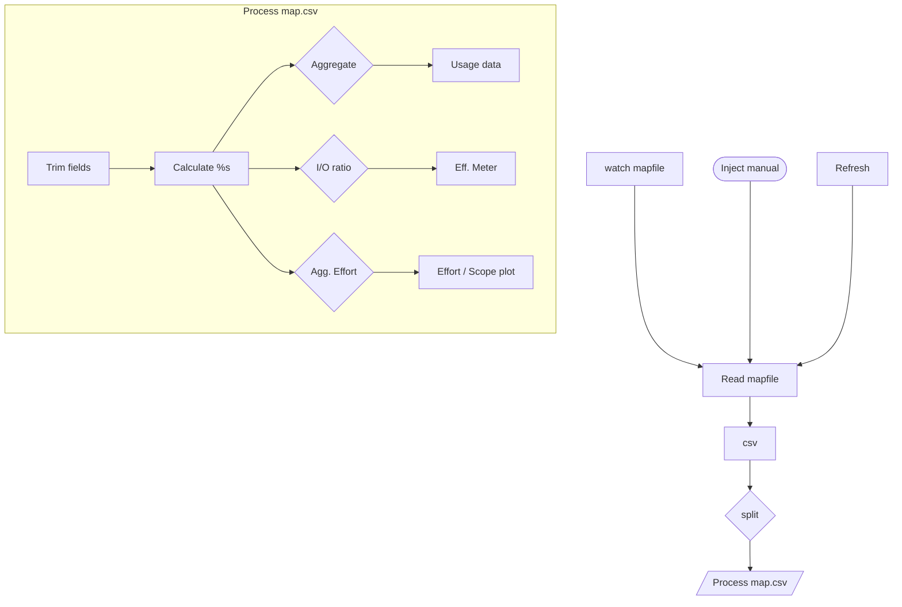

Agent-Metrics
=============

AI agent metrics

### About

Simple AI metrics dashboard specialized for the pi-agent. The /feedback skill maintains a .pi/MAP.csv file to keep track
of common codebase context bottlenecks.

### Implementation

The node-red implementation is simple enough, just a file watcher + some csv processing and JSONAta aggregation

